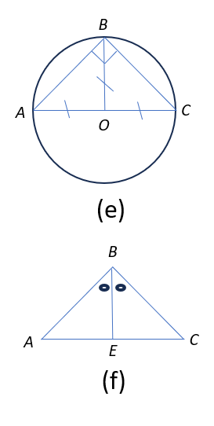
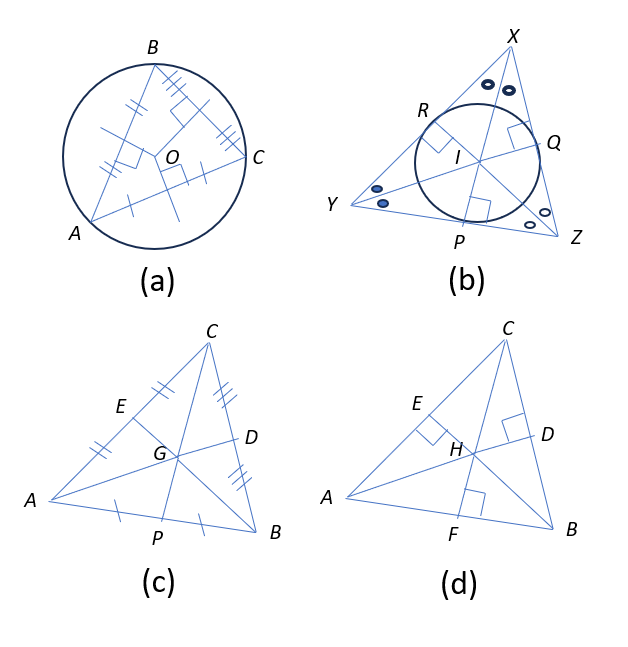
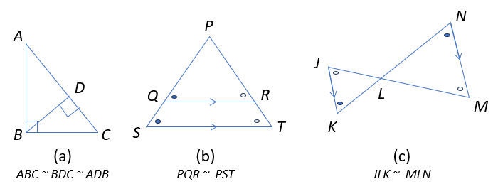
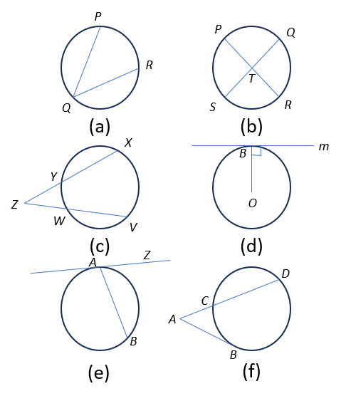
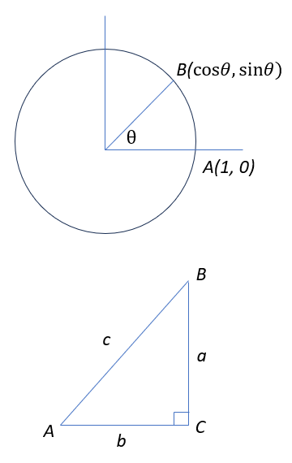

High School Geometry
====================

### Angles

* Angles formed when a transversal intersects two parallel lines  
  Corresponding angles are equal: $a=e,d=h,b=f,c=g$  
  Alternate interior angles are equal: $d=f, c=e$  
  Interior angles are supplementary $c+f=180^\circ, d+e=180^\circ$  
  Vertical angles are equal: $a=c, b=d, e=g, f=h$  

### Triangles

* Theorem: The sum of the angles of a triangle is $180^\circ$.
* Theorem: Exterior angle of a triangle is equal to the sum of its remote interior angles.
* Tests of Congruence: SSS, SAS, ASA, AAS (in congruent triangles, **CPCTC**)
* In an isosceles $\triangle$ ABC: If AB = AC, then $\angle B = \angle C$ (converse also true).
* In an isosceles $\triangle$ ABC: If AB = AC, the perpendicular from A to BC bisects BC.
* In an isosceles $\triangle$ ABC: If AB = AC, the bisector of BC that passes through A is perpendicular to BC.
* Theorem (Pythagoras): In right $\triangle$ ACB ($C=90^\circ$), $AC^2 + CB^2 = AB^2$.
* 30-60-90 Triangle: If side opposite 30 is s, the side opposite 90 is 2s, and the side opposite 60 is $\sqrt3$s.
* 45-45-90 Triangle: If the legs are s, the hypotenuse is $\sqrt2$s.
* Heron's Formula: If a, b, c are sides of a triangle, s is semi-perimeter, its area is $\sqrt{s(s-a)(s-b)(s-c)}$.
* In any triangle, the longest side is opposite the largest angle, and the smallest side is opposite the smallest.
* Triangle Inequality: The sum of any two sides of a triangle is greater than the third.
* In $\triangle$ ABC, C is acute iff $AB^2 \lt AC^2 + BC^2$; C is obtuse iff $AB^2 \gt AC^2 + BC^2$.
* The perpendicular bisectors of the sides of a triangle are concurrent at a point called the circumcenter.
  The circle centered at the circumcenter $O$ circumscribes the triangle and is called the circumcircle, and 
  its radius is called the circumradius. See figure (a).
* The angle bisectors of a triangle are concurrent at a point called the incenter. The common distance
  between the incenter $I$ and the sides of the triangle is called the inradius. The circle with center $I$
  is inscribed inside the triangle and is called the incircle. See figure (b).
* The median of a triangle connects a vertex of the triangle to the midpoint of the opposite side. The medians
  of a triangle are concurrent at a point called the centroid $G$ of the tirangle. The medians of a triangle
  divide the triangle into 6 triangles with equal area. The centroid cuts the mediats into a $2:1$ ratio.
  See figure (c). $\frac{AG}{GD} = \frac{BG}{GE} = \frac{CG}{GF} = \frac{2}{1}$.
* The altitudes of a triangle (extended if necessary) are concurrent at the orthocenter $H$ of the triangle.
  The orthocenter of an acute triangle is inside the triangle. The orthocenter of a right triangle is the vertex
  of the right angle. The orthocenter of an obtuse triangle is outside the triangle.
* The circumcenter of a right triangle is the midpoint of its hypotenuse, and the circum radius is one-half the
  hypotenuse. The median to the hypotenuse is equal in length to half the hypotenuse. See figure (e).
* Given any three non-collinear points, there is exactly one circle that passes through them.
* Angle Bisector Theorem: In $\triangle$ $ABC$ (see figure (f)), $E$ is on $AC$ such that $BE$ is the angle 
  bisector of $\angle B$, then $\frac{AB}{AE} = \frac{CB}{CE}$.
* The area of a triangle equals its inradius times half the perimeter.

### Similarity
  
* Corresponding angles in similar figures are equal, ratio of corresponding sides is the same.
* If $\triangle$ ABC $\sim$ $\triangle$ DEF, A=D, B=E, C=F, $\frac{AB}{DE}=\frac{BC}{EF}=\frac{CA}{FD}$.
* Tests of Triangle Similarity: AA, SAS, SSS.
* Parallel and perpendicular lines are clues to look for similar triangles (see figure for common setups)
* If two triangles are similar such that the sides of the larger triangle are $k$ times the smaller triangle,  
  the area of the larger triangle is $k^2$ times that of the smaller triangle.

### Polygons
* A polygon is an n-sided (n-gon) closed planar figure (n > 2).
* A regular polygon in which all sides and angles are equal.
* In an n-gon, the sum of the interior angles is $180^\circ(n-2)$.
* In an n-gon, the sum of the exterior angles is $360^\circ$.
* Properties of common quadrilaterals are given below.

<table border="1">
  <tr>
    <th>Quadrilateral</th>
    <th>Sides</th>
    <th>Angles</th>
    <th>Diagonals</th>
  </tr>
  <tr>
    <td>Kite</td>
    <td>Pairs of congruent sides form vertex angles.</td>
    <td>Non-vertex angles are congruent. Vertex angles are bisected by the incident diagonal.</td>
    <td>Diagonals are perpendicular. Diagonal joining non-vertex angles is bisected.</td>
  </tr>
  <tr>
    <td>Trapezoid</td>
    <td>Bases are parallel. In isosceles trapezoids, legs are congruent.</td>
    <td>Consecutive angles between bases are supplementary. 
        In isosceles trapezoids, base angles are congruent.</td>
    <td>In isosceles trapezoids, diagonals are congruent.</td>
  </tr>
<tr>
    <td>Parallelogram</td>
    <td>Opposite sides are parallel.</td>
    <td>Opposite angles are congruent. Consecutive angles between parallel sides are supplementary.</td>
    <td>Diagonals bisect each other.</td>
  </tr>
  <tr>
    <td>Rhombus</td>
    <td>All sides are the same length. Opposite sides are parallel.</td>
    <td>Opposite angles are congruent. Consecutive angles between parallel sides are supplementary.</td>
    <td>Diagonals are congruent and perpendicular bisectors of each other.</td>
  </tr>
  <tr>
    <td>Rectangle</td>
    <td>Opposite sides are parallel and congruent.</td>
    <td>All angles are $90^\circ$.</td>
    <td>Diagonals are congruent and bisect each other.</td>
  </tr>
  <tr>
    <td>Square</td>
    <td>All sides are the same length. Opposite sides are parallel.</td>
    <td>All angles are $90^\circ$.</td>
    <td>Diagonals are congruent and perpendicular bisectors of each other.</td>
  </tr>
</table>

### Perimeter and Area
* The perimeter of a an n-gon is the sum of its sides.
* The area of a figure is the number of unit squares that make up the figure.
* Area of a regular n-gon with side $s$ and apothem $a$ is $\frac{1}{2}nsa$.
* Areas of common polygons are given below.

<table class = "center" border="1">
  <tr>
    <th>Polygon</th>
    <th>Area</th>
  </tr>
  <tr>
    <td>Triangle</td>
    <td>If the base is $b$ and the height is $h$, $A = \frac{1}{2}bh$.</td>
  </tr>
  <tr>
    <td>Kite</td>
    <td>If diagonals are $d_1, d_2$, $A = \frac{1}{2}d_1d_2$.</td>
  </tr>
  <tr>
    <td>Trapezoid</td>
    <td>If the parallel bases are $b_1, b_2$ and height is $h$, $A = \frac{1}{2}(b_1 + b_2)h$</td>
  </tr>
  <tr>
    <td>Parallelogram</td>
    <td>If the base is $b$ and height is $h$, $A = bh$.</td>
  </tr>
  <tr>
    <td>Rhombus</td>
    <td>If diagonals are $d_1, d_2$, $A = \frac{1}{2}d_1d_2$.</td>
  </tr>
  <tr>
    <td>Rectangle</td>
    <td>If the length is $w$ and width is $w$, $A = lw$.</td>
  </tr>
  <tr>
    <td>Square</td>
    <td>If the side $s$, $A = s^2$.</td>
  </tr>
</table>

### Circles
  
* A circle is the locus of points that are the same distance (radius) from a given point (center).
* A chord is a segment intersecting the circle in two points. The diameter is the largest chord
  and it passes through the center.
* A secant is a line intersecting a circle in two points.
* A tangent is a line intersecting a circle in one point.
* The portion of a circle that connects two points is an arc; e.g., $\widehat{AB}$ denotes arc 
  joining $A$ and $B$ on the circle.
* The angle made by the radii joining the endpoints of an arc with the center is called the measure
  of the arc.
* The length of an arc of measure $\theta$ in a circle of radius $r$ is $\frac{\theta}{360^\circ}2\pi r$.
* The portion of a circle between two radii is called a sector.
* The portion of the circle between a chord and the arc connecting the endpoints of the chord is 
  the segment.
* The circumference (perimeter) of a circle of radius $r$ is $2\pi r$, and its area is $\pi r^2$.
* The area of a sector corresponding to an arc of measure $\theta$ is $\frac{\theta}{360^\circ}\pi r^2$.
* A angle formed by two chords is inscribed in the angle it cuts off.
* Inscribed Angle Theorem: An inscribed agnle equals $\frac{1}{2}$ the measure of the intercepted arc.
  In figure (a): $\angle PQR = \frac{\widehat{PR}}{2}$.
* The angle inscribed in a semicircle is $90^\circ$.
* Any two angles inscribed in the same arc are equal.
* Theorem: The measure of the angle formed by two intersecting chords is the average of the measues of
  the arcs intersected by the chords. In figure (b): $\angle PTS = \angle QTR = 
  \frac{\widehat{PS} + \widehat{QR}}{2}$.
* Theorem: Two secants that meet at a point outside a circle form an eangle equal to half the difference
  of the arcs they intercept. In figure (c): $\angle Z = \frac{\widehat{XV} - \widehat{YW}}{2}$.
* Theorem: A line tangent to a circle is perpendicular to the radius drawn to the point of tangency.
  See figure (d).
* Theorem: An angle formed by a tangent and a chord with point of tangency as an endpoint is half the 
  arc intercepted by the angle. In figure (e): $\angle ZAB = \frac{\widehat{AB}}{2}$.
* Theorem: The angle formed by a tangent and a secant is half the difference of the intercepted arcs.
  In figure (f): $\angle BAD = \frac{\widehat{BD} - \widehat{BC}}{2}$.
* Theorem: The angle formed by two tangents is half the difference of the intercepted arcs. Similar to 
  previous theorem.
* Theorem: The length of two tangent sements from the same point to a circle are equal.
* A cyclic quadrilateral is a quadrilateral that can be inscribed in a circle.
* Theorem: The opposite angles of any cyclic quadrilateral sum to $180^\circ$.

### Transformations

### Three-Dimensional Geometry
* The volume of a three dimenstional figure is a measure of the spece inside the figure.
* The total surface area of a figure is the total area of all the surfaces that form the 
  boundaries of the figure.
* The lateral surface area is the total area of all the surfaces that are not considered 'bases'.
* A polyhedron is a solid figure with polygons as its boundaries.
* A regular polyhedron is a onw whose faces are all congruent regular polygons.
* Euler's Formula for Polyhedra: $V + F = E + 2$, where $V$ is the number of vertices, 
  $F$ is the number of faces, $E$ is the number of edges.
* A prism has two congruent parallel faces as bases and all remaining faces are parallelograms.
* A pyramid is formed by connecting all the vertices of a polygon to a point (apex) that is not 
  in the same plane as the polygon (base). The height of the pyramid is the distance from the 
  apex to the base. The slant height is the distance from the apex to a side of the base.
* The volumes and surfaces areas of common three-dimensional figures are given below.

<table border="1">
  <tr>
    <th>Figure</th>
    <th>Parameters</th>
    <th>Volume $(V)$</th>
    <th>Surface Area $(S)$</th>
  </tr>
  <tr>
    <td>Prism</td>
    <td>Base area=$b$, height=$h$</td>
    <td>$V = bh$</td>
    <td>$S = 2b + areas\ of\ faces$</td>
  </tr>
  <tr>
    <td>Pyramid</td>
    <td>Base area=$b$, height=$h$</td>
    <td>$V = \frac{1}{3}bh$</td>
    <td>$S = b + areas\ of\ faces$</td>
  </tr>
  <tr>
    <td>Cylinder</td>
    <td>Radius of base=$r$, height=$h$</td>
    <td>$V = \pi r^2h$</td>
    <td>$S = \pi r^2 + 2\pi rh$</td>
  </tr>
  <tr>
    <td>Cone</td>
    <td>Radius of base=$r$, height=$h$</td>
    <td>$V = \frac{1}{3}\pi r^2h$</td>
    <td>$S = \pi r^2 + \pi rl$, where $l = \sqrt{r^2 + h^2}$ is the slant height</td>
  </tr>
</table>

### Analytic Geometry
* The distance between two points $(x_1, y_1)$ and $(x_2, y_2)$ is $\sqrt{(x_2 - x_1)^2 + (y_2 - y_1)^2}$.
* The midpoint of the segment joining $(x_1, y_1)$ and $(x_2, y_2)$ is $(\frac{x_1 + x_2}{2}, \frac{y_1 + y_2}{2})$. 
* The slope of a line joining two points $(x_1, y_1)$ and $(x_2, y_2)$ is $m = \frac{y_2 - y_1}{x_2 - x_1}$.
* If the slopes of two lines are $m_1$ and $m_2$, they are perpendicular iff $m_1m_2 = -1$.
* Slope-Intercept form equation of a line: $y = mx + c$, where $m$ is the slope, and $c$ is the $y$-intercept.
* Point-Slope form equation of a line: If $(x_1, y_1)$ and $(x_2, y_2)$ are two points on the line,
  $y - y_1 = m(x - x_1)$, where $m = \frac{y_2 - y_1}{x_2 - x_1}$.
* The equation of a circle with center $(h, k)$ and radius $r$ is $(x - h)^2 + (y - k)^2 = r^2$.

### Trigonometry
  
* Let point $A$ be $(1, 0)$ and point $B$ be on the unit circle such that $B$ is $\theta$ degrees 
  counterclockwise form $A$. Then, $\cos{\theta}$ and $\sin{\theta}$ are the $x$-coordinate and $y$-coordinate,
  respectively, of point $B$.
* $-1 \leq \sin{\theta}, \cos{\theta} \leq 1$ for any angle $\theta$.
* For an acute angle $A$ of a right $\triangle$ $ABC$  
  $\sin{A} = \frac{a}{c},\ \csc{A} = \frac{1}{\sin{A}} = \frac{c}{a}$  
  $\cos{A} = \frac{b}{c},\ \sec{A} = \frac{1}{\cos{A}} = \frac{c}{b}$  
  $\tan{A} = \frac{a}{b},\ \cot{A} = \frac{1}{\tan{A}} = \frac{b}{a}$  
* $\sin^2{A} + \cos^2{A} = 1$
* $\sin{A} = \cos{(90^\circ - A)}$
* In any $\triangle$ $ABC$, let $BC = a$, $AC = b$, and $AB = c$. Then, we have  
  $[ABC] = \frac{1}{2}ab\sin{C}$  
  $c^2 = a^2 + b^2 - 2ab\cos{C}$ (Law of Cosines)  
  $\frac{a}{\sin{A}} = \frac{b}{\sin{B}} = \frac{c}{\sin{C}}$ (Law of Sines) 
* Some trigonometric identities  
  $\sin{(\alpha \pm \beta)} = \sin{\alpha}\cos{\beta} \pm \cos{\alpha}\sin{\beta}$     
  $\cos{(\alpha \pm \beta)} = \cos{\alpha}\cos{\beta} \mp \sin{\alpha}\sin{\beta}$   
  $\sin{2\theta} = 2\sin{\theta}\cos{\theta}$  
  $\cos{2\theta} = \cos^2{\theta} - \sin^2{\theta}$ 
* Ratios for common angles are given below.   

<table border="1">
  <tr>
    <th>$\theta$</th>
    <th>$\sin{\theta}$</th>
    <th>$\cos{\theta}$</th>
    <th>$\tan{\theta}$</th>
  </tr>
  <tr>
    <td>$0^\circ$</td>
    <td>$0$</td>
    <td>$1$</td>
    <td>$0$</td>
  </tr>
  <tr>
    <td>$30^\circ$</td>
    <td>$\frac{1}{2}$</td>
    <td>$\frac{\sqrt3}{2}$</td>
    <td>$\frac{1}{\sqrt3}$</td>
  </tr>
  <tr>
    <td>$45^\circ$</td>
    <td>$\frac{1}{\sqrt2}$</td>
    <td>$\frac{1}{\sqrt2}$</td>
    <td>$1$</td>
  </tr>
  <tr>
    <td>$60^\circ$</td>
    <td>$\frac{\sqrt3}{2}$</td>
    <td>$\frac{1}{2}$</td>
    <td>$\sqrt3$</td>
  </tr>
  <tr>
    <td>$90^\circ$</td>
    <td>$1$</td>
    <td>$0$</td>
    <td>undefined</td>
  </tr>
  <tr>
    <td>$180^\circ$</td>
    <td>$0$</td>
    <td>$-1$</td>
    <td>$0$</td>
  </tr>
</table>

### Problem Solving Strategies
* x
* x
* x

   
    
  
  
  
  

